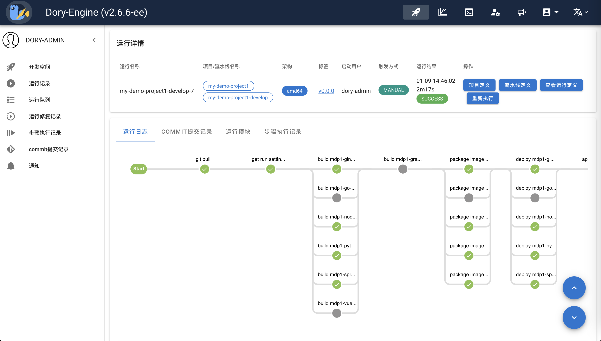

# Dory-Engine是一个非常简单的开源k8s远程开发环境

- [中文文档](README.md)

- [Github](https://github.com/dory-engine/dory-engine)
- [Gitee](https://gitee.com/dory-engine/dory-engine)


详细参见官方网站: [https://doryengine.com](https://doryengine.com)

## 什么是`Dory-Engine`

- `Dory-Engine` 是一个非常简单的开源k8s远程开发环境，使用场景如下:

1. 开发人员通过IDE编写代码，并推送到代码仓库
2. Dory-Engine拉取代码仓库的源代码，自动编译打包成容器镜像并部署到k8s中
3. 使用Dory-Engine快速在k8s中部署各种中间件，进行远程联调测试




- 快速开始视频介绍:

[🚀🚀🚀 Dory-Engine是一个非常简单的开源k8s远程开发环境 (https://www.bilibili.com/video/BV1Zw4m1r7aw/)](https://www.bilibili.com/video/BV1Zw4m1r7aw/)

1. 创建开发项目
1. 设置流水线
1. 执行流水线
1. 部署中间件到k8s
1. 在k8s中进行联调测试

- `Dory-Engine` 具有以下特点:

1. 不用学: 不用学习复杂的k8s技术原理，5分钟即可快速上手部署应用
1. 不用配: 不需要配置任何代码仓库、镜像仓库和k8s连接参数
1. 不用写: 不需要编写任何k8s部署清单和流水线脚本

### `Dory-Engine`架构


1. 部署简单: 支持kubernetes部署
1. 扩展性强: 内置的编译、扫描、自动化测试等步骤都在docker容器中执行，可以通过自定义容器镜像支持各种编程语言编译环境和自定义步骤
1. 上手极快: 自动接管各种代码仓库、依赖仓库、镜像仓库、扫描仓库，开发人员无需做任何配置，编译、打包、部署的流水线自动就绪
1. 功能强大: 支持部署到多个k8s环境，支持x86/arm架构编译部署，支持gpu资源调度，支持多种灰度发布，主机环境部署，数据库脚本部署

### 什么是dorycli

- dorycli是Dory-Engine的命令行工具，可以用于安装Dory-Engine服务，管理Dory-Engine的各项配置，以及通过命令行方式运行流水线。

- 获取更多帮助请运行以下命令

```shell script
dorycli -h
```

- 子命令结构:

```text
dorycli
├── admin # 配置项管理，需要管理员权限
│   ├── apply # 把文件、目录或者stdin中的配置参数应用到项目配置信息中，需要项目维护者权限
│   ├── delete # 删除项目配置信息，需要项目维护者权限
│   └── get # 获取项目配置信息，需要项目维护者权限
├── console # 项目控制台管理，需要项目维护者权限
│   ├── apply # 把文件、目录或者stdin中的配置参数应用到Dory-Engine的配置项中，需要项目维护者权限
│   ├── delete # 删除项目配置项，需要项目维护者权限
│   └── get # 获取项目配置项，需要项目维护者权限
├── def # 管理项目定义
│   ├── apply # 应用项目定义配置项
│   ├── clone # 把项目定义的模块复制到其他环境
│   ├── delete # 删除项目定义中的模块
│   ├── get # 获取项目定义
│   └── patch # 通过补丁更新项目定义
├── install # 把Dory-Engine安装在kubernetes集群或者docker主机上
│   ├── check # 检查安装的前提条件
│   ├── ha # 创建高可用kubernetes集群的负载均衡器
│   │   ├── print # 打印高可用kubernetes集群负载均衡器安装配置的YAML文件
│   │   └── script # 创建负载均衡器的配置文件、docker-compose文件以及高可用kubernetes集群的初始化配置文件
│   ├── print # 打印安装配置YAML文件
│   ├── pull # 拉取并构建相关容器镜像
│   └── script # 手动安装Dory-Engine
├── login # 登录到Dory-Engine
├── logout # 从Dory-Engine注销
├── pipeline # 获取或者执行流水线
│   ├── execute # 执行流水线
│   └── get # 获取流水线
├── project # 管理项目
│   ├── execute # 执行项目批处理任务
│   └── get # 获取项目信息
├── run # 管理流水线运行记录
│   ├── abort # 终止执行中的流水线
│   ├── get # 查看流水线运行记录
│   └── logs # 查看流水线运行日志
└── version # 显示版本信息
```

## 安装 dorycli

### 二进制包方式安装

- 从[dorycli Releases](https://github.com/dory-engine/dorycli/releases)下载相应的二进制安装包. 一旦下载后，二进制执行文件就可以在任何地方执行，你无需把执行文件放到全局目录，假如你没有主机的相关权限的话。

- 更好的方式是把二进制执行文件放到PATH所在的目录，这样你在任何地方都可以调用dorycli，常见的路径为 /user/local/bin

### 源码方式安装

- dorycli 需要golangv1.18.x以上版本编译。

```shell script
# 克隆源代码
git clone https://github.com/dory-engine/dorycli.git

# 从源代码编译dorycli
cd dorycli
go mod tidy && go build -o dorycli
mv dorycli /usr/local/bin/
```

### go命令直接安装

```shell script
# 直接安装
go install github.com/dory-engine/dorycli

# 查看安装位置
which dorycli
```

## 使用 `dorycli` 安装 `Dory-Engine`

- dorycli 命令行工具
    - [Github](https://github.com/dory-engine/dorycli)
    - [Gitee](https://gitee.com/dory-engine/dorycli)

```shell script
  ##############################
  # 请根据以下步骤指引把Dory-Engine安装到kubernetes集群中:
  
  # 1. 检查把Dory-Engine安装到kubernetes集群的前提条件，被接管的kubernetes集群的容器运行时为docker
  dorycli install check --runtime docker
  
  # 2. (选项1) 打印把Dory-Engine安装到kubernetes集群的YAML安装配置文件，被接管的kubernetes集群的容器运行时为docker（快速安装模式，仅安装Dory-Engine基础组件）
  dorycli install print --runtime docker > install-dory.yaml
  
  # 2. (选项2) 打印把Dory-Engine安装到kubernetes集群的YAML安装配置文件，被接管的kubernetes集群的容器运行时为docker（完整安装模式，同时会安装代码仓库、镜像仓库、依赖与制品仓库以及代码扫描仓库）
  dorycli install print --runtime docker --full > install-dory.yaml
  
  # 3. 根据安装配置文件说明，手工修改安装配置文件
  vi install-dory.yaml
  
  # 4. 拉取并构建安装Dory-Engine所需要的容器镜像
  dorycli install pull -f install-dory.yaml
  
  # 5. 手动方式安装Dory-Engine到kubernetes集群，执行命令将会输出安装说明文件以及所有部署清单和配置文件
  dorycli install script -o readme-dory -f install-dory.yaml
```

- 视频指引

[🚀🚀🚀 使用dorycli完整安装Dory-Engine (https://www.bilibili.com/video/BV1x94y167T5/)](https://www.bilibili.com/video/BV1x94y167T5/)

1. 安装Dory-Engine核心组件
1. 安装镜像仓库、代码仓库、依赖与制品仓库、镜像扫描仓库

[🚀🚀🚀 使用dorycli快速安装Dory-Engine (https://www.bilibili.com/video/BV1aG411D7Sj/)](https://www.bilibili.com/video/BV1aG411D7Sj/)

1. 仅安装Dory-Engine核心组件

## Dory-Engine的使用演示

- **重要必看 ################################**

[🚀🚀🚀 Dory-Engine GitOps云环境管理 (https://www.bilibili.com/video/BV1Y8411z7em/)](https://www.bilibili.com/video/BV1Y8411z7em/)

1. 介绍通过OPS交互式流水线，无需编译构建直接把镜像部署到k8s，实现CI与CD分离
1. 介绍通过OPS交互式流水线，实现k8s中的应用版本回滚
1. 如何通过DORY部署中间件到k8s
1. 如何通过DORY部署跳板机容器到k8s中，并调试应用
1. 如何通过OPS交互式流水线，把代码仓库中的数据库脚本在数据库中执行注入和回滚
1. 如何通过流水线，执行代码仓库中的自动化测试脚本，支持接口自动化测试(robotframework)、界面自动化测试(robotframework)、性能自动化测试(jmeter)
1. 如何通过dorycli命令行工具执行流水线
1. 如何通过dorycli命令行工具批量管理流水线配置

[🚀🚀🚀 Dory-Engine深入云原生应用部署 (https://www.bilibili.com/video/BV18g4y1D77S/)](https://www.bilibili.com/video/BV18g4y1D77S/)

1. 详细介绍微服务部署到k8s的各项参数设置

- **相关视频 ################################**

[Dory-Engine平台工程最佳实践 (https://www.bilibili.com/video/BV1oM4y117Pj)](https://www.bilibili.com/video/BV1oM4y117Pj)

1. 介绍平台工程实践的背景
1. 介绍如何通过DORY实现应用从源代码部署到云原生环境

[大规模云原生转型血泪史 (https://www.bilibili.com/video/BV1Tu4y1n7CC)](https://www.bilibili.com/video/BV1Tu4y1n7CC)

1. 介绍大规模云原生转型的实践案例
1. 介绍DORY的核心功能
1. 介绍DORY的特性与优势

[Dory-Engine多云环境部署应用 (https://www.bilibili.com/video/BV1Qg4y1F7y7/)](https://www.bilibili.com/video/BV1Qg4y1F7y7/)

1. 介绍如何通过DORY把应用部署到多个k8s集群

[Dory-Engine异构环境部署应用 (https://www.bilibili.com/video/BV1vk4y1x7qX/)](https://www.bilibili.com/video/BV1vk4y1x7qX/)

1. 介绍如何同时把应用的部分微服务部署到k8s，部分微服务部署到主机环境

[Dory-Engine混合灰度发布 (https://www.bilibili.com/video/BV1o14y1B74U/)](https://www.bilibili.com/video/BV1o14y1B74U/)

1. 介绍如何使用DORY实现多个微服务和复杂微服务调用链的混合灰度发布（蓝绿发布、金丝雀发布、AB测试发布）

[Dory-Engine自定义上云流程 (https://www.bilibili.com/video/BV1Uj411n78S/)](https://www.bilibili.com/video/BV1Uj411n78S/)

1. 介绍如何新增编译构建环境，让DORY支持各种编程语言
1. 介绍如何在流水线中插入自定义步骤，并执行自定义步骤
1. 介绍如何定义OPS批处理流水线，让OPS交互式流水线自动执行批处理，无需人工输入
