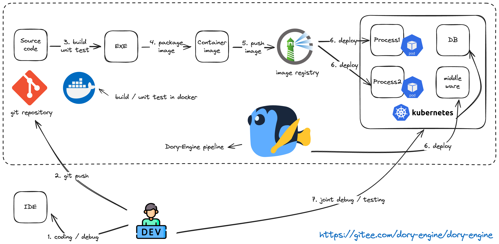
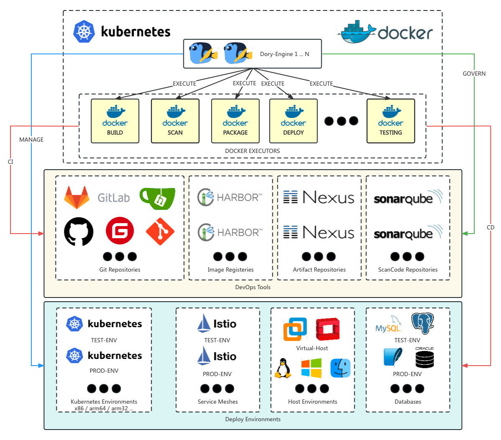

# Dory-Engine是一个非常简单的应用上云引擎，这是命令行客户端

- [中文文档](README.md)

- [Github](https://github.com/dory-engine/dorycli)
- [Gitee](https://gitee.com/dory-engine/dorycli)


详细参见官方网站: [https://doryengine.com](https://doryengine.com)

- [Github dory-engine](https://github.com/dory-engine/dory-engine)
- [Gitee dory-engine](https://gitee.com/dory-engine/dory-engine)

## 什么是`Dory-Engine`

[🚀🚀🚀 Dory-Engine平台工程最佳实践 (https://www.bilibili.com/video/BV1oM4y117Pj/)](https://www.bilibili.com/video/BV1oM4y117Pj/)



- `Dory-Engine` 是一个非常简单的应用上云引擎，开发人员不用学、不用写、不用配就可以自行把自己编写的程序从源代码，编译、打包、部署到各类k8s环境或者主机环境中。

1. 不用学: 不需要学习如何编写复杂的上云脚本和如何部署应用到k8s，所有配置都所见即所得一看就懂
2. 不用写: 不需要编写复杂的构建、打包、部署的上云脚本，也不需要编写复杂的k8s应用部署文件，只需要几项简单的配置就可以设置好自己的上云流水线
3. 不用配: 不需要配置各个DevOps工具链和k8s环境如何互相配合完成应用上云，项目一开通所有工具链和环境自动完成配置

### `Dory-Engine`架构



- 可以以多实例的方式部署在k8s或者docker中
- 所有上云步骤都在docker中执行，因此可以很轻松定义自己特有的上云步骤
- 直接接管各种DevOps工具链，所有DevOps工具链的配置都是自动完成，用户可以通过流水线自动完成各种CI持续集成步骤
- 直接接管各种应用部署环境，包括各种k8s、服务网格、主机环境和数据库环境，所有应用部署环境自动完成初始化配置，开发人员可以通过流水线自动完成各种CD持续部署步骤

### 什么是dorycli

- dorycli是Dory-Engine的命令行工具，可以用于安装Dory-Engine服务，管理Dory-Engine的各项配置，以及通过命令行方式运行流水线。

- 获取更多帮助请运行以下命令

```shell script
dorycli -h
```

- 子命令结构:

```text
dorycli
├── admin # 配置项管理，需要管理员权限
│   ├── apply # 把文件、目录或者stdin中的配置参数应用到Dory-Engine的配置项中，需要管理员权限
│   ├── delete # 删除配置项，需要管理员权限
│   └── get # 获取配置项，需要管理员权限
├── def # 管理项目定义
│   ├── apply # 应用项目定义配置项
│   ├── clone # 把项目定义的模块复制到其他环境
│   ├── delete # 删除项目定义中的模块
│   ├── get # 获取项目定义
│   └── patch # 通过补丁更新项目定义
├── install # 把Dory-Engine安装在kubernetes集群或者docker主机上
│   ├── check # 检查安装的前提条件
│   ├── ha # 创建高可用kubernetes集群的负载均衡器
│   │   ├── print # 打印高可用kubernetes集群负载均衡器安装配置的YAML文件
│   │   └── script # 创建负载均衡器的配置文件、docker-compose文件以及高可用kubernetes集群的初始化配置文件
│   ├── print # 打印安装配置YAML文件
│   ├── pull # 拉取并构建相关容器镜像
│   ├── run # 自动安装Dory-Engine
│   └── script # 手动安装Dory-Engine
├── login # 登录到Dory-Engine
├── logout # 从Dory-Engine注销
├── pipeline # 获取或者执行流水线
│   ├── execute # 执行流水线
│   └── get # 获取流水线
├── project # 管理项目
│   ├── execute # 执行项目批处理任务
│   └── get # 获取项目信息
├── run # 管理流水线运行记录
│   ├── abort # 终止执行中的流水线
│   ├── get # 查看流水线运行记录
│   └── logs # 查看流水线运行日志
└── version # 显示版本信息
```

## 安装 dorycli

### 二进制包方式安装

- 从[dorycli Releases](https://github.com/dory-engine/dorycli/releases)下载相应的二进制安装包. 一旦下载后，二进制执行文件就可以在任何地方执行，你无需把执行文件放到全局目录，假如你没有主机的相关权限的话。

- 更好的方式是把二进制执行文件放到PATH所在的目录，这样你在任何地方都可以调用dorycli，常见的路径为 /user/local/bin

### 源码方式安装

- dorycli 需要golangv1.18.x以上版本编译。

```shell script
# 克隆源代码
git clone https://github.com/dory-engine/dorycli.git

# 从源代码编译dorycli
cd dorycli
go mod tidy && go build -o dorycli
mv dorycli /usr/local/bin/
```

### go命令直接安装

```shell script
# 直接安装
go install github.com/dory-engine/dorycli

# 查看安装位置
which dorycli
```

## 使用 `dorycli` 安装 `Dory-Engine`

[🚀🚀🚀 使用dorycli快速安装Dory-Engine (https://www.bilibili.com/video/BV1aG411D7Sj/)](https://www.bilibili.com/video/BV1aG411D7Sj/)

## Dory-Engine的使用演示

[🚀🚀🚀 大规模云原生转型血泪史 (https://www.bilibili.com/video/BV1Tu4y1n7CC)](https://www.bilibili.com/video/BV1Tu4y1n7CC)

[🚀🚀🚀 Dory-Engine多云环境部署应用 (https://www.bilibili.com/video/BV1Qg4y1F7y7/)](https://www.bilibili.com/video/BV1Qg4y1F7y7/)

[🚀🚀🚀 Dory-Engine异构环境部署应用 (https://www.bilibili.com/video/BV1vk4y1x7qX/)](https://www.bilibili.com/video/BV1vk4y1x7qX/)

[🚀🚀🚀 Dory-Engine混合灰度发布 (https://www.bilibili.com/video/BV1o14y1B74U/)](https://www.bilibili.com/video/BV1o14y1B74U/)

[🚀🚀🚀 Dory-Engine GitOps云环境管理 (https://www.bilibili.com/video/BV1Y8411z7em/)](https://www.bilibili.com/video/BV1Y8411z7em/)

[🚀🚀🚀 Dory-Engine自定义上云流程 (https://www.bilibili.com/video/BV1Uj411n78S/)](https://www.bilibili.com/video/BV1Uj411n78S/)

[🚀🚀🚀 Dory-Engine深入云原生应用部署 (https://www.bilibili.com/video/BV18g4y1D77S/)](https://www.bilibili.com/video/BV18g4y1D77S/)
